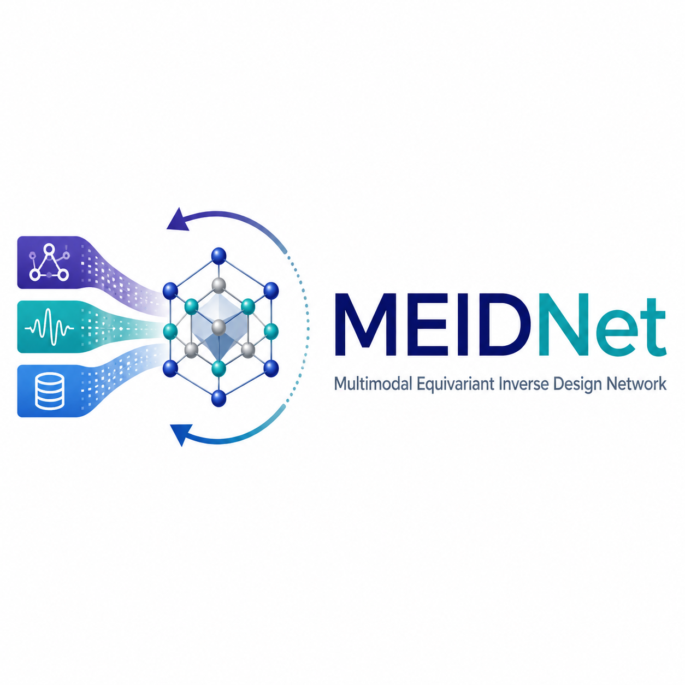

<p align="center">
  
</p>

<p align="center"><em>Design crystalline materials from target properties — with your own data, your own rules, and no code to edit.</em></p>

<p align="center">
  <a href="https://babu09-meidnet.hf.space/docs/"><b>Documentation</b></a> ·
  <a href="https://babu09-meidnet.hf.space/"><b>Try it in your browser</b></a> ·
  <a href="https://www.nature.com/articles/s41524-026-02153-3">Paper</a> ·
  <a href="https://github.com/ABnano/MEIDNet/releases/tag/v1.0.0-paper">v1.0 code as published</a>
</p>

---

MEIDNet learns one latent space shared by **crystal structures** and their **properties**
(contrastive alignment of an equivariant graph encoder and a property encoder), then
searches that space for new materials that hit property targets while obeying the
chemical and structural rules of a **material family**.

MEIDNet 2.0 turns the published perovskite code into a framework:

| You want to… | You do… |
|---|---|
| see what it does in 30 seconds | `meidnet demo` or the [browser demo](https://babu09-meidnet.hf.space/) |
| use **your** structures + properties | put them in a table, run `meidnet init / check / train / generate` |
| change targets, elements, rules | edit `meidnet.yaml` — or move sliders in **MEIDNet Studio** and export it |
| a different material family | copy a family `.yaml` (prototype + site groups + rules) |
| your own rule | a 5-line Python function registered as a constraint |
| understand every decision | each step writes a plain-language HTML report (data check, training, generation) |

The published cubic-ABX₃ perovskite model (band gap + formation enthalpy, Perov-5) is
**example application #1**; it runs unchanged and bit-identically (tests prove it).

## Install

```bash
pip install meidnet            # core (PyTorch CPU wheels work; CUDA optional)
pip install "meidnet[stability]"   # + MACE stability screening
```

From source: `git clone https://github.com/ABnano/MEIDNet && cd MEIDNet && pip install -e ".[dev]"`.

## Try it (2 minutes, CPU is fine)

```bash
meidnet demo                      # halide perovskites, band gap 2.0 eV → CIFs + report
meidnet studio                    # interactive workbench with the published model
```

## Use your own data (the main path)

Your data is a table with one row per material plus the structures as CIF text (a `cif`
column) or files (`structures/<id>.cif`):

```
material_id   cif                         band_gap   dielectric
mat_001       data_mat_001 ...            1.42       18.3
mat_002       data_mat_001 ...            2.16       11.7
```

```bash
meidnet init --table materials.csv --properties band_gap dielectric --family perovskite_abx3 --variant oxide
meidnet check meidnet.yaml      # → check_report.html: what is usable, what was skipped and why
meidnet train meidnet.yaml      # → model.pt + training_report.html: how accurate, did modalities align
meidnet generate meidnet.yaml   # → CIFs + generation_report.html: every candidate and why it passed
```

Everything you can change is in `meidnet.yaml`, with a one-line explanation per setting
([reference](https://babu09-meidnet.hf.space/docs/reference/config.html)). No Python needed.

## MEIDNet Studio — see the effect of every change

```bash
meidnet studio meidnet.yaml
```

A local web page shows the workflow as a strip of colour-coded blocks **Data → Model →
Family → Rules → Targets → Search → Candidates**. Move a rule's limit or a target and watch
the change flow through every later block, explained in plain words: how many compositions
still pass, which are predicted closest, which of your earlier candidates would now be
rejected. Beginner mode shows the input, logic and output of each block, and *Behind the
scenes* shows the YAML and Python that do the same thing.

- **Your data in the browser:** upload a table (CSV / Excel / JSON) with CIF structures, map
  the columns, check it and train a model — every block then uses your properties.
- **Edit as text:** the configuration as YAML; errors name the exact setting.
- **Explore in 3D:** the design space, your data or the candidates as a property map linked
  to a crystal viewer ([chemiscope](https://chemiscope.org)).
- "Run search" runs the paper's latent optimisation live; every candidate comes with its
  checklist and a rotatable cell. Export `meidnet.yaml` to repeat the run from the command line.

No installation needed to try it: the [hosted Studio](https://huggingface.co/spaces/Babu09/MEIDNet)
runs on Hugging Face ([direct link](https://babu09-meidnet.hf.space/)).

## What is in the box

```
meidnet/
  config.py       the meidnet.yaml schema (pydantic) — single source of truth for CLI, docs, Studio
  data.py         tables + CIFs → prototype-aligned feature vectors, with a skip report
  model.py        SE(3)-equivariant crystal autoencoder + property autoencoder, shared latent
  train.py        the five-term objective of the paper, validation metrics in physical units
  family.py       material families from YAML: prototype, site groups, charges, lattice rule, variants
  constraints.py  hard rules (charge balance, tolerance factor, …) — each returns value, window, sentence
  terms.py        soft search terms and logit transforms used during the latent optimisation
  generate.py     the inverse-design loop (latent search → decode → rules → rank → save), with a funnel log
  designspace.py  every composition a family can make, with rule descriptors and model predictions
  report.py       plain-language HTML reports; svg.py: dependency-free charts
  studio/         the interactive workbench (stdlib HTTP server + one HTML page)
  families/       perovskite_abx3.yaml, double_perovskite_a2bbx6.yaml
tests/            incl. byte-level regression against the published v1 code (tests/legacy_v1/)
examples/         Perov-5 reproduction, custom-rule plugin, the paper's generated CIFs
docs/             the website (MkDocs)   notebooks/  Colab tutorials   app/  Hugging Face demo
```

## Scope (honest version)

* Generation works for **prototype families**: a fixed arrangement of sites whose
  occupants and cell size are chosen (ABX₃, A₂BB′X₆, and anything you describe the same
  way, up to `max_sites` atoms). It does **not** invent new atomic arrangements.
* Properties: any number of scalar columns. Spectra/images as modalities are on the
  [roadmap](https://babu09-meidnet.hf.space/docs/understand/limits.html), not in this release.
* Predicted properties are **model estimates**. Confirm candidates with DFT or experiment;
  `meidnet screen` (MACE) is a first filter.

## Reproducing the paper

```bash
meidnet download-data                       # Perov-5 (CDVAE split) → data/perov5/
meidnet init --template perov5 -o examples/perov5/meidnet.yaml
meidnet train examples/perov5/meidnet.yaml  # ~1 h on a laptop GPU for 200 epochs
meidnet generate examples/perov5/meidnet.yaml --model checkpoints/dual_autoencoder_clip_earlyfusion_propertyaware_2k.pth
```

`pytest -m slow` re-runs the frozen v1 generation code (`tests/legacy_v1/`) and checks that
MEIDNet 2 produces the same CIFs, predictions and file names.

## Citation

```bibtex
@article{meidnet2026,
  title   = {MEIDNet: Multimodal generative AI framework for inverse materials design},
  author  = {Anand Babu and Rog{\'e}rio Almeida Gouv{\^e}a and Pierre Vandergheynst and Gian-Marco Rignanese},
  journal = {npj Computational Materials},
  year    = {2026},
  doi     = {10.1038/s41524-026-02153-3}
}
```

MIT licence. Perov-5 data: Xie et al., CDVAE (ICLR 2022); Castelli et al. (2012).
