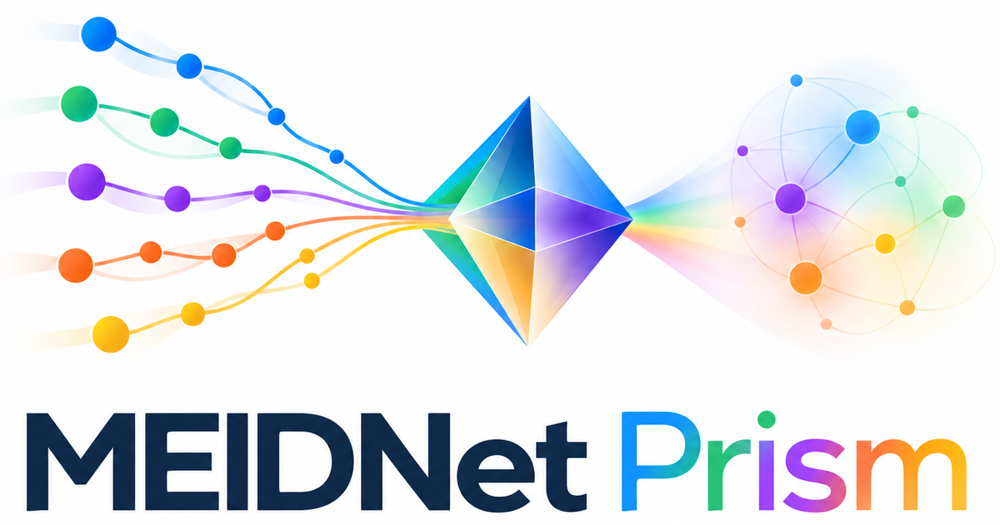

<p align="center"></p>

# MEIDNet Prism

[← MEIDNet Prism home](https://babu09-meidnet.hf.space/studio/) · the documentation of the MEIDNet framework and its platform.

**Design crystalline materials from target properties — with your own data, your own rules, and no code to edit.**

MEIDNet learns one latent space shared by crystal structures and their properties, then searches it for new
materials that hit property targets while obeying the chemical and structural rules of a *material family*.
The published cubic-perovskite model (band gap + formation enthalpy) is one application of it; the framework
accepts any table of structures and scalar properties and any prototype family you describe.

<figure class="tour-video">
  <video controls muted playsinline preload="metadata" poster="assets/meidnet_tour_poster.png" style="width:100%;max-width:960px;border-radius:12px">
    <source src="assets/meidnet_tour.webm" type="video/webm">
    Your browser cannot play this video: <a href="assets/meidnet_tour.webm">download it</a>.
  </video>
  <figcaption>MEIDNet in one minute: data, model, family, rules, targets, search and candidates. The same tour opens
  on a first visit to the <a href="https://babu09-meidnet.hf.space/">live Studio</a> (the “▶ How it works” button replays it).</figcaption>
</figure>

<div class="grid cards" markdown>

-   :material-play-circle:{ .lg .middle } **Try MEIDNet**

    ---

    See what it does in 30 seconds: the [live Studio](https://babu09-meidnet.hf.space/studio/) needs nothing installed;
    `meidnet demo` runs on any laptop.

    [:octicons-arrow-right-24: 5-minute quickstart](start/quickstart.md)

-   :material-database-import:{ .lg .middle } **Use MEIDNet on my data**

    ---

    A table with an id, properties and CIFs is all you need. Four commands take you from
    "is my data usable?" to candidates with explanations.

    [:octicons-arrow-right-24: Bring your own dataset](use/your-data.md)

-   :material-tune:{ .lg .middle } **Change what it does**

    ---

    Targets, elements, rules, family — all in one YAML file, or by moving sliders in
    MEIDNet Studio and exporting the file.

    [:octicons-arrow-right-24: Recipes](recipes/change-targets.md)

-   :material-head-question:{ .lg .middle } **Understand it**

    ---

    How the two modalities are aligned, how the search works, what the reports mean,
    and where the limits are.

    [:octicons-arrow-right-24: How MEIDNet works](understand/how-it-works.md)

</div>

## The workflow

```
   Data ──► Model ──► Family ──► Rules ──► Targets ──► Search ──► Candidates
   table    shared    prototype  hard      property   latent     CIFs + report
   + CIFs   latent    + sites    checks    goals      optimisation
```

Each block is a setting in `meidnet.yaml`, a node in [MEIDNet Studio](use/studio.md) — where changing one
block immediately shows its effect on the ones after it — and a section in the HTML report each step writes.

## Honest scope

- Generation works for **prototype families**: a fixed arrangement of sites whose occupants and cell size are
  chosen (ABX₃ perovskites, A₂BB′X₆ double perovskites, and anything you describe the same way). MEIDNet does
  not invent new atomic arrangements. [Details and roadmap](understand/limits.md).
- Predicted properties are the model's estimates. The reports say when a prediction is an extrapolation.
  Confirm candidates with DFT or experiment; `meidnet screen` is a first filter.

## Paper

A. Babu, R. Almeida Gouvêa, P. Vandergheynst, G.-M. Rignanese, *MEIDNet: Multimodal generative AI framework for
inverse materials design*, npj Computational Materials (2026). [Citation and benchmarks](research/paper.md) ·
[code as published (v1.0)](https://github.com/ABnano/MEIDNet/releases/tag/v1.0.0-paper).
